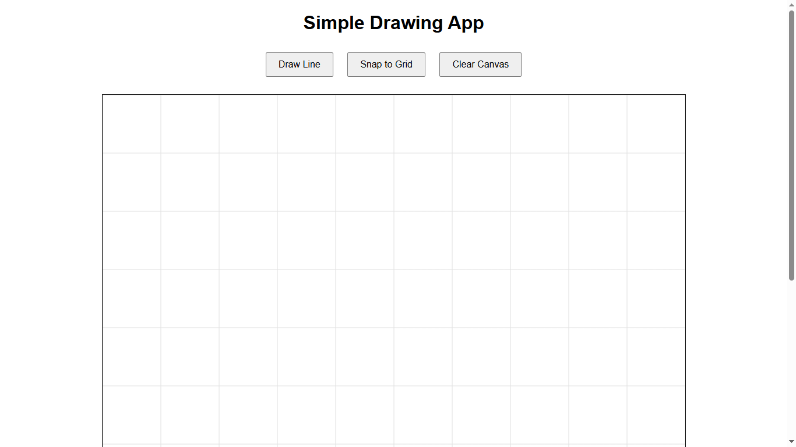
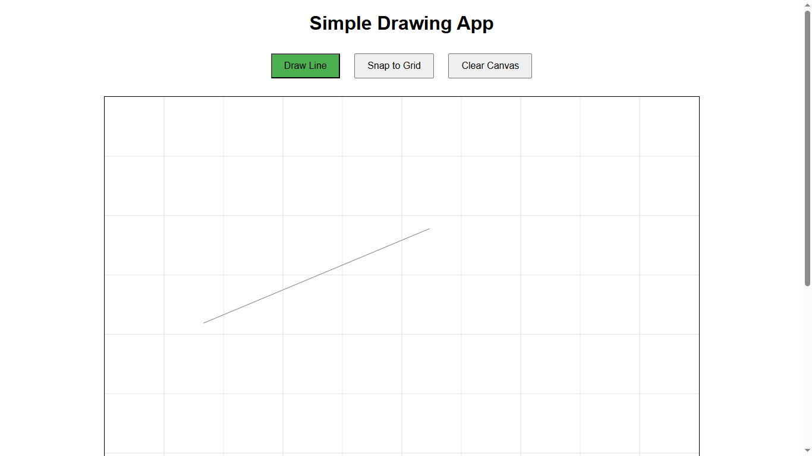

# Simple Drawing App



**Version:** Alpha 0.2.10  
**Author:** Gerasimos Makis Mouzakitis  
**Last Update:** April 8, 2025

A simple drawing application that allows users to draw lines on a canvas with features like snapping to grid, selection, and customization.

## Screenshots


*Drawing lines with snap-to-grid enabled*


*Viewing and editing line properties*


*Multiple snapping options in action*

## Features

- **Line Drawing**: Draw lines by clicking to set start and end points
- **Dynamic Preview**: See a live preview while drawing lines
- **Selection**: Select lines by clicking on them
- **Properties Window**: View and edit line properties
- **Snapping**:
  - Snap to Grid: Align points to the nearest grid intersection
  - Snap to Midpoint: Snap to the midpoint of existing lines
  - Snap to Endpoint: Snap to the endpoints of existing lines
- **Clear Canvas**: Remove all lines and reset the canvas
- **Settings Menu**: Customize default line properties:
  - Color
  - Thickness
  - Layer

## Changelog

### Version Alpha 0.2.10
- Updated version metadata in `index.html` and `config.js`.
- Improved metadata for SEO and social media sharing.
- Enhanced documentation and README.

### Version Alpha 0.2.9 Stable
- Updated version logging to reflect the stable release.
- Improved logging for start and end points of lines.
- Removed unnecessary logs for preview lines.
- Ensured consistent functionality for snapping to grid and clearing the canvas.

## Project Structure

The project is organized as follows:

simple-drawing-app
├── src
│   ├── index.html       # HTML structure of the application
│   ├── styles.css       # Styles for the application
│   ├── js
│   │   ├── app.js       # Main JavaScript file for initializing the app
│   │   ├── canvas.js    # Handles canvas rendering and drawing
│   │   ├── events.js    # Manages user interactions and event listeners
│   │   ├── state.js     # Manages application state
│   │   └── config.js    # Stores app configuration and default settings
├── CHANGELOG.md         # Log of changes made to the project
├── FUNCTIONALITY_LOG.md # Log of implemented functionalities
└── README.md            # Documentation for the project

## Installation

1. **Clone the repository**:
   ```bash
   git clone https://github.com/your-username/simple-drawing-app.git
   cd simple-drawing-app
   ```

2. **Install dependencies**:
   ```bash
   npm install
   ```

3. **Open the application**:
   Open `src/index.html` in your web browser to view and use the application.

## Usage

1. **Draw a Line**:
   - Click on the canvas to set the start point.
   - Move the mouse and click again to set the end point.
   - A line will be drawn between the two points.

2. **Enable Snapping**:
   - Click the "Snap to Grid" button to enable/disable snapping to grid.

3. **Select a Line**:
   - Click on any existing line to select it.
   - View its properties in the properties window.

4. **Clear Canvas**:
   - Click the "Clear Canvas" button to remove all lines.

## TODO

- [ ] Add functionality to undo/redo actions.
- [ ] Allow users to save the canvas as an image.
- [ ] Add support for multiple shapes (e.g., rectangles, circles).
- [ ] Implement a settings menu for customizing grid size and line properties.

## Contributing

Feel free to submit issues or pull requests if you have suggestions or improvements for the application. Please see our [Contributing Guidelines](CONTRIBUTING.md) for details on how to get started.

## License

This project is licensed under the Apache License 2.0. See the [LICENSE](LICENSE) file for details.